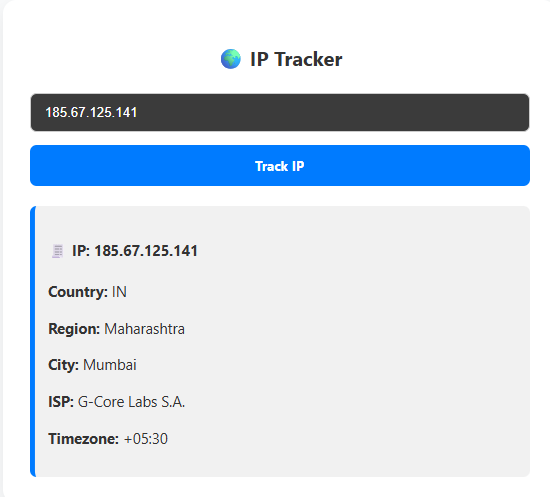

Email Breach & Validation Checker
=================================

A comprehensive security toolkit that combines email breach detection, validation, IP tracking, and AI-powered email classification. Available as both a web application and browser extension, this tool helps users verify email security, detect data breaches, and analyze email authenticity.

🌐 Live Demo
------------

**Try it now**: <https://email-tool-kiit-cua0g4bxaycxb3hd.centralindia-01.azurewebsites.net/>


🛡️ Core Features
-----------------

### Email Breach & Validation

-   **Data Breach Detection**: Check if your email has been involved in known data breaches using the "Have I Been Pwned" database
-   **Email Format Validation**: Verify proper email formatting and syntax
-   **Domain Verification**: Check MX records and mail server availability
-   **SMTP Validation**: Test server connectivity and email deliverability
-   **Disposable Email Detection**: Identify temporary or throwaway email services
-   **Role-based Email Detection**: Detect generic business emails (admin@, info@, etc.)
-   **Free Provider Recognition**: Identify emails from free services (Gmail, Yahoo, etc.)


### IP Address Tracking

-   **Geolocation Tracking**: Get detailed location information for any IP address
-   **ISP Identification**: Identify internet service providers
-   **Timezone Detection**: Determine timezone information
-   **Country & Region Mapping**: Detailed geographical data



### AI Email Classifier

-   **Email Content Analysis**: Analyze email content for legitimacy
-   **Phishing Detection**: Identify potential phishing attempts
-   **Security Alert Verification**: Verify if security emails are legitimate
-   **Smart Classification**: AI-powered email categorization (Legitimate/Suspicious/Malicious)


### Browser Extension

-   **One-Click Checking**: Quick access from your browser toolbar
-   **Privacy-First Design**: SHA-1 hashing with k-anonymity protection
-   **Instant Notifications**: Real-time alerts for breaches and invalid emails
-   **No Data Storage**: All operations performed locally with minimal API calls


🚀 Installation & Setup
-----------------------

### Web Application Access

#### Option 1: Use the Live Demo (Recommended)

Access the tool instantly at: **<https://email-tool-kiit-cua0g4bxaycxb3hd.centralindia-01.azurewebsites.net/>**

No installation required! The web application is hosted on Azure and ready to use.

#### Option 2: Local Development Setup

##### Prerequisites

-   Node.js (version 16 or higher)
-   npm or yarn package manager

##### Quick Start

```
# Clone the repository
git clone https://github.com/CaptainCrunchilicious/email-check-tool.git
cd email-check-tool

# Install dependencies
npm install

# Start development server
npm run dev

```

The application will be available at `http://localhost:5173`

### Browser Extension

#### Installation Methods

**Method 1: Developer Mode (Recommended)**

1.  Download the extension file using the download button
2.  Open Chrome and navigate to `chrome://extensions/`
3.  Enable "Developer mode" by toggling the switch in the top-right corner
4.  Click "Load unpacked" button
5.  Extract the .crx file to a folder and select that folder
6.  The extension will now appear in your extensions list

**Method 2: Manual Installation**

1.  Download the .crx file
2.  Open Chrome and go to `chrome://extensions/`
3.  Enable "Developer mode"
4.  Drag and drop the .crx file onto the extensions page
5.  Click "Add extension" when prompted


📋 How to Use
-------------

### Web Application

**Quick Access**: Visit <https://email-tool-kiit-cua0g4bxaycxb3hd.centralindia-01.azurewebsites.net/> to start using the tool immediately.

#### Email Breach Check

1.  Navigate to the main interface
2.  Enter your email address in the input field
3.  Click "Check Now" button
4.  Review comprehensive results including:
    -   Data breach status
    -   Email format validation
    -   Domain verification (MX records)
    -   SMTP server check
    -   Disposable email detection
    -   Role-based email identification
    -   Free provider recognition

#### IP Address Tracking

1.  Access the IP Tracker tool
2.  Enter any IP address
3.  Click "Track IP"
4.  View detailed information:
    -   Geographic location (Country, Region, City)
    -   Internet Service Provider (ISP)
    -   Timezone information

#### AI Email Classification

1.  Open the AI Email Classifier
2.  Paste suspicious email content
3.  Add optional JSON headers for enhanced analysis
4.  Click "Classify Email"
5.  Review AI-powered legitimacy assessment

### Browser Extension


#### Step-by-Step Process:

1.  **Enter Your Email**: Click the extension icon and enter the email address
2.  **Email Format Verification**: Validates format and checks domain mail servers
3.  **Security Check**: Securely hashes your email and checks against breach databases
4.  **Instant Results**: Get immediate feedback on email security status

🔧 API Integration
------------------

The tool integrates with several security APIs:

-   **Have I Been Pwned API**: For breach detection
-   **Email Verification APIs**: For SMTP and domain validation
-   **IP Geolocation Services**: For IP tracking functionality
-   **Custom AI Models**: For email content classification

Configure API keys in your `.env` file:

```
VITE_HIBP_API_KEY=your_hibp_api_key
VITE_EMAIL_API_KEY=your_email_verification_key
VITE_IP_API_KEY=your_ip_geolocation_key

```

🛡️ Privacy & Security Features
-------------------------------

### Privacy-First Design

-   **SHA-1 Hashing**: Email addresses are hashed before API queries
-   **K-Anonymity Protection**: Only partial hashes are sent to external services
-   **No Email Storage**: Email addresses are never stored permanently
-   **Local Operations**: Maximum processing done locally
-   **Minimal API Calls**: Reduced external requests for privacy

### Security Features

-   **Encrypted Transmission**: All data sent over HTTPS
-   **No Tracking**: No user behavior tracking
-   **Open Source**: Code is transparent and auditable
-   **Regular Updates**: Database updates for latest breach information

📊 Technical Features
---------------------

### Email Validation Checks

-   ✅ **Format Validation**: RFC-compliant email format checking
-   ✅ **MX Record Verification**: Domain mail server validation
-   ✅ **SMTP Testing**: Server connectivity verification
-   ✅ **Disposable Detection**: Temporary email service identification
-   ✅ **Role Account Detection**: Generic business email identification
-   ✅ **Free Provider Recognition**: Free email service detection

### Breach Detection

-   🔍 **Comprehensive Database**: Access to major data breach databases
-   🔐 **Secure Queries**: Privacy-preserving breach checking
-   ⚡ **Real-time Results**: Instant breach status updates
-   📊 **Detailed Reports**: Information about specific breaches found

🚀 Deployment
-------------

### Production Build

```
# Build for production
npm run build

# Preview production build
npm run preview

```

### Azure Deployment

The application is currently deployed on Azure Web Services and accessible at: **<https://email-tool-kiit-cua0g4bxaycxb3hd.centralindia-01.azurewebsites.net/>**

### Browser Extension Packaging

```
# Package extension for distribution
npm run build:extension

# Generate .crx file
npm run package:extension

```

🤝 Contributing
---------------

We welcome contributions! Please follow these guidelines:

1.  Fork the repository
2.  Create a feature branch (`git checkout -b feature/AmazingFeature`)
3.  Commit your changes (`git commit -m 'Add AmazingFeature'`)
4.  Push to the branch (`git push origin feature/AmazingFeature`)
5.  Open a Pull Request

### Development Setup

```
# Install dependencies
npm install

# Run development server
npm run dev

# Run tests
npm test

# Build extension
npm run build:extension

```

📝 License
----------

This project is licensed under the MIT License - see the [LICENSE](https://claude.ai/chat/LICENSE) file for details.

🔮 Roadmap
----------

-   [ ] **Enhanced AI Classification**: Improve phishing detection accuracy
-   [ ] **Mobile App**: Native mobile applications for iOS/Android
-   [ ] **API Access**: Public API for developers
-   [ ] **Bulk Processing**: Handle multiple emails simultaneously
-   [ ] **Chrome Web Store**: Official Chrome extension listing
-   [ ] **Firefox Support**: Mozilla Firefox extension
-   [ ] **Advanced Reporting**: Detailed security reports and analytics
-   [ ] **Team Features**: Multi-user accounts and sharing
-   [ ] **Integration Plugins**: Outlook, Gmail, and other email client plugins

🆘 Support & Issues
-------------------

If you encounter any issues or need help:

1.  Check existing [Issues](https://github.com/CaptainCrunchilicious/email-check-tool/issues)
2.  Create a new issue with detailed information
3.  Include screenshots if reporting bugs
4.  Specify whether you're using the web app or browser extension

🙏 Acknowledgments
------------------

-   **Have I Been Pwned**: For providing the breach detection database
-   **React & Vite**: For the modern web development framework
-   **Chrome Extension APIs**: For browser integration capabilities
-   **AI/ML Libraries**: For intelligent email classification
-   **Open Source Community**: For various libraries and tools used
-   **Microsoft Azure**: For reliable cloud hosting services

📈 Performance
--------------

-   ⚡ **Fast Verification**: Sub-second email checking
-   🔒 **Secure Processing**: Privacy-preserving operations
-   📱 **Responsive Design**: Works on all device sizes
-   🌐 **Cross-Platform**: Web app + browser extension
-   💾 **Lightweight**: Minimal resource usage
-   ☁️ **Cloud-Hosted**: Reliable Azure infrastructure

* * * * *

**🔐 Stay Safe Online with Email Breach & Validation Checker**

*Protect your digital identity with comprehensive email security checking*

**🌐 Live Demo**: <https://email-tool-kiit-cua0g4bxaycxb3hd.centralindia-01.azurewebsites.net/>

**Made with ❤️ by [CaptainCrunchilicious](https://github.com/CaptainCrunchilicious)**

For more information, visit the [GitHub repository](https://github.com/CaptainCrunchilicious/email-check-tool)
